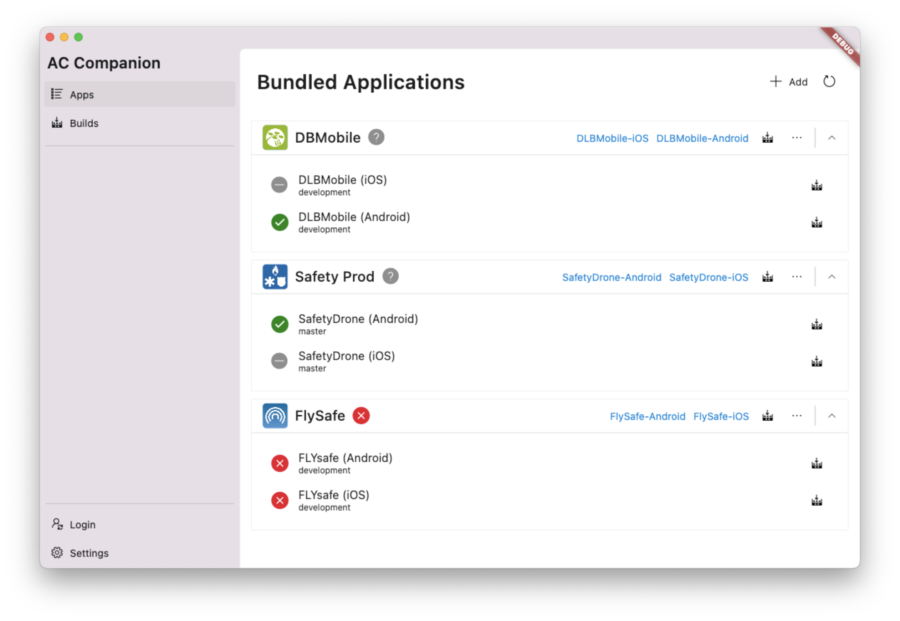
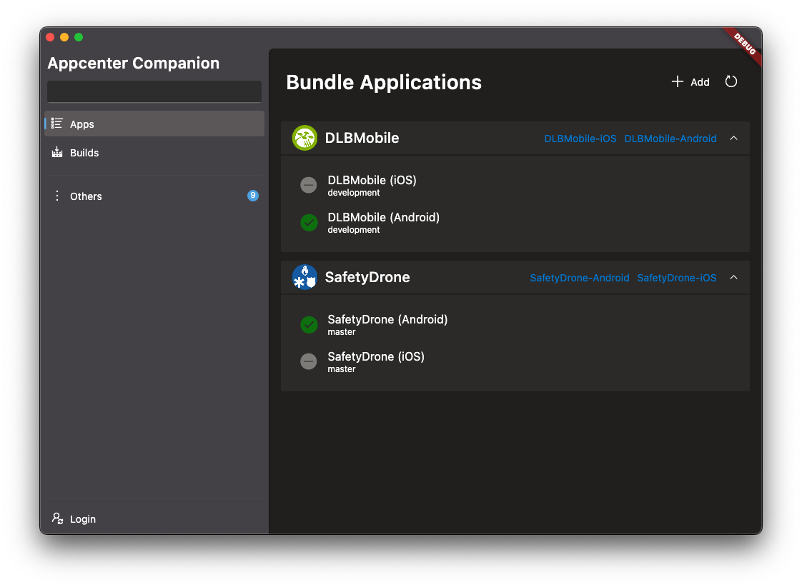

[](https://github.com/zenoxs/appcenter-companion/actions/workflows/build.yml)
# AppCenter Companion

A companion app to help manage your applications on appcenter.




## Build generated source

```shell
flutter pub run build_runner build
# or with the watch 
flutter pub run build_runner watch
```

## Getting Started

TODO
